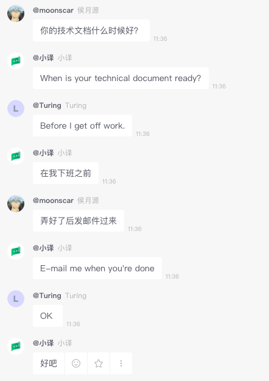

# caiyunxiaoyi-bearychat-bot
xiaoyi-bearychat-bot

**作品名称：** 小译全能翻译机器人
**创意描述：** 小译全能翻译机器人接入了彩云小译API，彩云小译 API可以用来把信息翻译到指定的语言，其可以支持文本、网页、PDF/Word文档、语音、视频等多种形式的翻译，支持的语种包括了中、英、日等多语种互翻。我们通过彩云小译API在bearychat里搭建了小译全能翻译机器人，实现了bearychat聊天的全场景翻译！

**场景一** 实时翻译
和外国同事协作时无奈英文水平捉急，单词都认识就是不知道什么意思？小译机器人来帮你！

我下班前就搞定这个文档，然而...
都第二天中午了，我还没下班...

**场景二** 单句翻译
很多时候只想翻译某一句话？ 没问题，只要喊一声小译关门，接下来就只有“小译”开头的句子才翻译了。

你可以这样膜一下为中国互联网鞠躬尽瘁的程序员们：

还可以这样文艺一下，表达拼搏在外思乡的情绪：

当然，还可以这样(stack overflow热门问题翻译)：

连表情都能翻哦！

想再打开火力全开模式，只要喊一句：

**场景三** 网页翻译
聊天内容还不满足？直接给你翻译英文网页，中英对照，排版精美！
github 热门issue翻译现场

返回后的网页点进后是这样的

热门BBC新闻

点进去后就成了中英对照排版精美的网页。

**场景四** 生成故事
加班太无聊，小译来讲个惊悚的故事吧。
